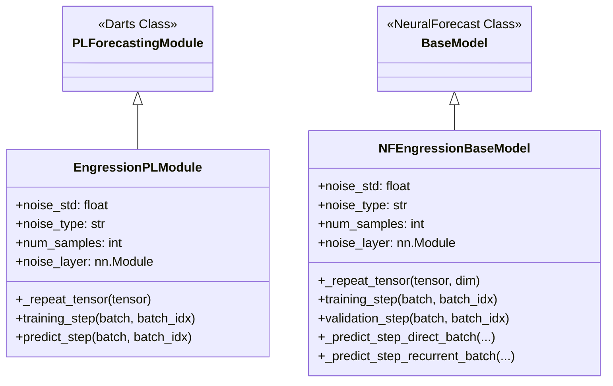

# EngressionTS Engineering Decisions

EngressionTS extends existing time series forecasting architectures with **Engression** (a distribution-free probabilistic forecasting framework using stochastic neural networks) while keeping codebase changes to an absolute minimum. 


---

## 1. Unified User Interface

EngressionTS exposes a consistent user interface that conforms to the native pipelines of the backend libraries (**Darts** and **NeuralForecast**).

### Darts Model Usage
Darts wrappers use `TimeSeries` objects for training and predictions:

```python
from engressionts.models.darts.nhits import EnHiTSModel

# Instantiate the wrapped Darts model
model = EnHiTSModel(
    input_chunk_length=24,
    output_chunk_length=24,
    noise_std=0.1,
    num_samples=20
)

# Train using Darts native training pipeline
model.fit(series)

# Predict sample paths
pred = model.predict(n=24, num_samples=20)
```

### NeuralForecast Model Usage
NeuralForecast wrappers integrate directly with the standard `NeuralForecast` class and operate on pandas DataFrames:

```python
from engressionts.models.neuralforecast.enpatchtst import EnPatchTST
from neuralforecast import NeuralForecast

# Instantiate the wrapped NeuralForecast model
model = EnPatchTST(
    h=24,
    input_size=96,
    noise_std=1.0,
    num_samples=20
)

# Pass the model to the native NeuralForecast pipeline
nf = NeuralForecast(models=[model], freq="D")
nf.fit(df)
pred = nf.predict()
```

---

## 2. Backend-Specific Base Classes

Rather than implementing noise injection and Monte Carlo sampling logic for every single model wrapper, common probabilistic functionality is encapsulated in two backend-specific base classes in [base_engression.py](file:///c:/Users/Anusha/engression/engression-ts/engressionts/base/base_engression.py):



### Darts Base: `EngressionPLModule`
Inherits from Darts' [PLForecastingModule](file:///c:/Users/Anusha/engression/engression-ts/engressionts/base/base_engression.py#L15).
* **Noise Layer Initialization**: Creates the noise injection layer using the config parameters.
* **Batch Replication**: Replicates the input tensors `num_samples` times along the batch dimension during training so that the model runs multiple noise-perturbed samples in parallel.
* **Loss Function**: Directly calls the [energy_score_loss](file:///c:/Users/Anusha/engression/engression-ts/engressionts/losses/energy_score.py#L6-L52) function in its `training_step`.
* **Inference Mode**: Overrides `predict_step` to temporarily enable training mode on the noise layer, ensuring stochastic perturbation is active when Darts generates Monte Carlo prediction samples.

### NeuralForecast Base: `NFEngressionBaseModel`
Inherits from NeuralForecast's [BaseModel](file:///c:/Users/Anusha/engression/engression-ts/engressionts/base/base_engression.py#L105).
* **Quantile Extraction**: Integrates with [EnergyScoreLoss](file:///c:/Users/Anusha/engression/engression-ts/engressionts/losses/energy_score.py#L55) to map the stochastic prediction samples to the specific output quantiles expected by NeuralForecast's schema (e.g., median, lo-80, hi-80).
* **Recurrent Step Handling**: Implements `_predict_step_recurrent_batch` to step through recurrent autoregressive predictions, repeating coordinates/scalers dynamically.

---

## 3. Common Wrapper Template

Each wrapper (e.g., [EnHiTSModel](file:///c:/Users/Anusha/engression/engression-ts/engressionts/models/darts/nhits.py#L488) or [EnPatchTST](file:///c:/Users/Anusha/engression/engression-ts/engressionts/models/neuralforecast/enpatchtst.py#L11)) follows a strict implementation pattern:

1. **Keep Native Parameters**: Preserve the original constructor's parameters (e.g. layers, heads, channels).
2. **Inject Engression Arguments**: Add `noise_std`, `noise_type`, and `num_samples` to the constructor.
3. **Change Base Class**: Inherit from base classes such as `PastCovariatesTorchModel`/`MixedCovariatesTorchModel` (Darts) or `NFEngressionBaseModel` (NeuralForecast).
4. **Call Super constructor**: Pass relevant arguments up to initialize base attributes.
5. **Inject Noise in `forward()`**: Inject noise via `self.noise_layer(x)` at the very beginning of the forward pass, keeping all subsequent layers unmodified.

---

## 4. Lookback Parameters

Different forecasting backends use different parameter names to specify the historical lookback length. EngressionTS respects this native naming:
* **Darts wrappers**: Use `input_chunk_length`.
* **NeuralForecast wrappers**: Use `input_size`.

---

## 5. Tensor Shapes and Noise Injection

EngressionTS injects noise directly onto the in-sample target tensors without altering the channel, temporal, or covariate dimensions.

### Darts Tensor Flow
* **Noise Point**: Injected inside the private module class's `forward` pass (e.g., `_EnHiTSModule`).
* **Input Tensor Shape**: `(B, T, D)` where `B` is batch size, `T` is `input_chunk_length`, and `D` is `input_dim`.
* **Noise Operation**:
  ```python
  x = self.noise_layer(x)  # Shape remains (B, T, D)
  ```

### NeuralForecast Tensor Flow
* **Noise Point**: Injected inside the wrapper's `forward` pass (e.g., `EnPatchTST`).
* **Input Tensor Shape**: `(B * M, L, D)` where `B` is batch size, `M` is `num_samples`, `L` is `input_size`, and `D` is variables.
* **Noise Operation**:
  ```python
  x = windows_batch["insample_y"]  # Shape: (B * M, L, D)
  x = self.noise_layer(x)          # Shape remains (B * M, L, D)
  ```

---

## 6. Minimal Code Modification Principle

We treat deterministic forecasting architectures as black boxes:
* Attention layers, convolution kernels, feed-forward networks, and recurrent units are **never modified**.
* Wrappers only add:
  1. Class inheritance.
  2. Constructor parameters.
  3. A single `self.noise_layer(x)` call in `forward()`.
  4. Defaulting loss to the Energy Score.
* This ensures that downstream library updates can be integrated with minimal maintenance overhead.

---

## 7. Native NeuralForecast Wrappers

Rather than utilizing Darts' `NeuralForecastModel` class (which adds wrapping layers), EngressionTS implements **native NeuralForecast wrappers** (e.g. [EnPatchTST](file:///c:/Users/Anusha/engression/engression-ts/engressionts/models/neuralforecast/enpatchtst.py)).

### Benefits:
* **Preserves Native Pipeline**: Leverages NeuralForecast's standard window generation (`_create_windows`), data loading, optimizer scheduler pipelines, and checkpoint handling.
* **Avoids Layered Wrapping**: Accesses training and inference loops directly without translating settings across frameworks, improving performance and reducing abstraction overhead.
* **Unified API Integration**: The wrapped model is a first-class citizen of the `NeuralForecast` class, fitting into standard pandas-in, pandas-out configurations.